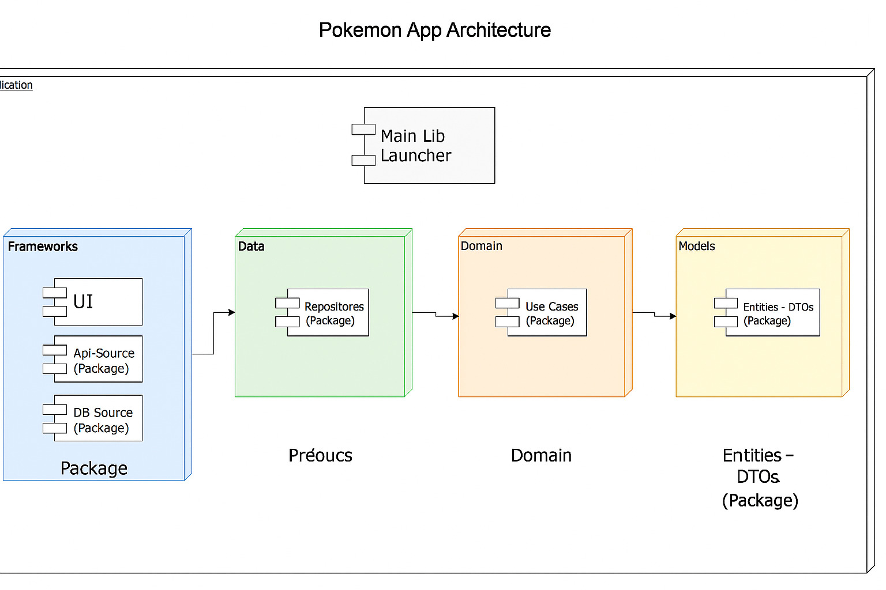

# pokemon_app

## DEBUG

Para ejecutar el menú de scripts, puedes ejecutar el comando en la terminal bash desde el proyecto raíz: scripts/menu.sh.

- Ejecuta la opción 1: limpiar proyecto.
- Ejecuta la opción 2: obtener paquete.
- Ejecuta la opción 6: Dart build runner/all.

## Script Utils

### Menu

Hay scripts que nos ayudan en el desarrollo.

1. Limpiar proyecto (limpiar todos los módulos del proyecto)
1. Obtener paquete (resolver las dependencias de todos los módulos del proyecto)
1. Flujo de negocio (crear flujo de negocio: caso de uso, repositorio, fuente API)

## Arquitectura del Proyecto

Este proyecto está basado en el modelo de Arquitectura Limpia (Clean Architecture), el cual organiza el código en módulos independientes con el objetivo de lograr una alta escalabilidad, mantenibilidad y testabilidad.

Se implementa una arquitectura modular, donde cada paquete cumple una única responsabilidad y si en algun momento se quisiera separar el projecto por repositorios , cada capa esta lista para ser migrada a un repositorio propio.

Esto permite que cada módulo gestione sus propias dependencias y evolucione sin afectar al resto del sistema, fomentando la reutilización de código y una mayor estabilidad del proyecto.

## Seguridad y persistencia

Para garantizar la seguridad en la manipulación de datos, el proyecto utiliza una base de datos cifrada.

## IA

El uso de la IA ha sido de gran ayuda para reducir tiempo en escribir el codigo de los modelos tambien se ha utilizado para la consulta de errores para la creacion de modelos, lograr entender el API , para indicarme que parametros debia usar.

